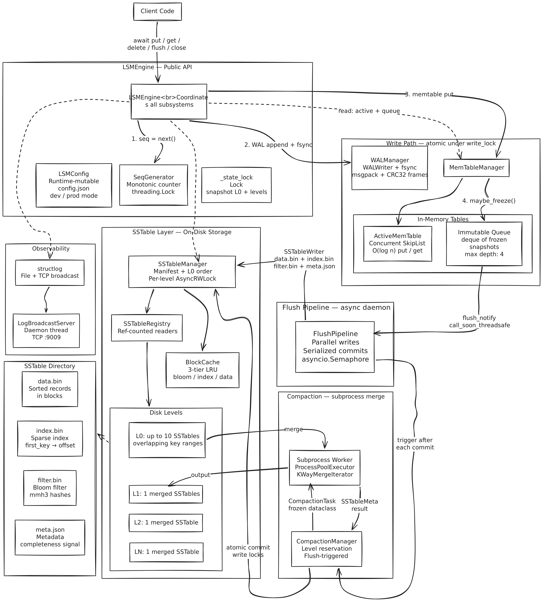

# lsm-kv

A production-grade **Log-Structured Merge Tree** key-value store written in Python 3.12+.

Durable, crash-safe, and async-first — with a concurrent skip-list memtable, tiered compaction, bloom filters, and runtime-mutable configuration.

## Features

- **Async-first API** — `put`, `get`, `delete`, `flush`, `close` are all async
- **Write-ahead log** — crash recovery via WAL replay with msgpack + CRC32 framing
- **Concurrent skip-list memtable** — fine-grained per-node locking for writes, lock-free reads
- **SSTable persistence** — sorted on-disk tables with bloom filters, sparse indexes, and mmap reads
- **Tiered compaction** — L0 → L1 → L2 → L3 with subprocess-based merging (bypasses GIL)
- **Parallel flush pipeline** — concurrent SSTable writes with event-chain ordered commits
- **Block cache** — three-tier LRU (data blocks, indexes, bloom filters) with independent eviction
- **Runtime configuration** — dev/prod modes with live-updatable thresholds persisted to disk
- **Web dashboard** — FastAPI backend + React SPA for interactive engine exploration
- **Structured logging** — structlog with file output + TCP broadcast for real-time streaming
- **Formal contracts** — ABCs (`StorageEngine`, `Serializable`, `MemTable`) + Protocols + `.pyi` stubs
- **Comprehensive docs** — MkDocs site with API reference, internals, design docs, and SVG diagrams

## Quick Start

```bash
uv sync                # install dependencies
uv run poe start       # start the interactive REPL
```

### As a Library

```python
from app.engine import LSMEngine

async def main():
    engine = await LSMEngine.open("./data")

    await engine.put(b"user:1", b"Alice")
    value = await engine.get(b"user:1")    # b"Alice"
    await engine.delete(b"user:1")

    await engine.flush()                    # force memtable → SSTable
    print(engine.stats())                   # EngineStats snapshot

    await engine.close()
```

### REPL Commands

| Command | Description |
|---------|-------------|
| `put <key> <value>` | Write a key-value pair |
| `get <key>` | Read a value |
| `del <key>` | Tombstone a key |
| `flush` | Force-flush memtable to SSTable |
| `mem` | List all active and immutable memtables |
| `mem <id>` | Show entries of a specific memtable |
| `disk` | List all SSTables by level |
| `disk <id>` | Show entries of a specific SSTable |
| `stats` | Show engine statistics |
| `config` | Show current configuration as JSON |
| `config set <k> <v>` | Update a config parameter at runtime |
| `trace <key>` | Trace a lookup step-by-step through all layers |

## Web Dashboard

```bash
uv run poe web         # build React frontend + start FastAPI on :8081
```

Open `http://localhost:8081` — interactive dashboard with KV explorer, memtable viewer, SSTable browser, compaction monitor, live log streaming, and a web terminal.

## Architecture



**Write path**: `put()` → seq generation → WAL fsync → skip list insert → conditional freeze → flush pipeline signal

**Read path**: active memtable → immutable queue → L0 SSTables (all files) → L1/L2/L3 (one per level)

## Project Structure

```
app/
├── engine/           # LSMEngine, managers, flush pipeline, compaction
├── memtable/         # SkipList, ActiveMemTable, ImmutableMemTable
├── sstable/          # Writer, Reader, Registry, Meta
├── wal/              # WALWriter, WALEntry
├── bloom/            # mmh3-backed BloomFilter
├── cache/            # Three-tier LRU BlockCache
├── index/            # SparseIndex (bisect-based block lookup)
├── compaction/       # CompactionTask, subprocess worker
├── common/           # ABCs, errors, CRC32, encoding, rwlock, merge iterator
├── observability/    # structlog config, TCP LogBroadcastServer
├── tools/            # CLI log stream utility
└── types.py          # Type aliases, constants, OpType enum, Protocols
web/
├── server.py         # FastAPI app with lifespan engine management
├── routers/          # REST API endpoints (kv, mem, disk, stats, config, ...)
└── ws/               # WebSocket log bridge
frontend/             # React SPA (Vite + TypeScript)
tests/                # 25 test modules, 211+ tests
docs/                 # MkDocs source (API reference, internals, design docs)
```

## Configuration

The engine uses a `config.json` file with runtime-mutable settings. Dev and prod modes have different defaults:

| Setting | Dev default | Prod default | Purpose |
|---------|-------------|--------------|---------|
| `max_memtable_entries` | 10 | — | Freeze trigger (entry count) |
| `max_memtable_size_mb` | — | 64 | Freeze trigger (byte size) |
| `l0_compaction_threshold` | 10 | 10 | L0 file count before compaction |
| `bloom_fpr_dev` | 0.05 | — | Bloom filter false positive rate |
| `bloom_fpr_prod` | — | 0.01 | Bloom filter false positive rate |
| `flush_max_workers` | 2 | 2 | Parallel flush pipeline workers |
| `max_levels` | 3 | 3 | Compaction depth (L0–L3) |

Update at runtime:

```python
engine.update_config("bloom_fpr_prod", 0.001)
engine.update_config("max_memtable_entries", 50)
```

## Development

### Task Runner

All tasks run via [poethepoet](https://github.com/nat-n/poethepoet) through `uv run poe <task>`:

| Task | Command | Description |
|------|---------|-------------|
| `start` | `uv run poe start` | Start the REPL (skip checks) |
| `run` | `uv run poe run` | Run all checks then start REPL |
| `test` | `uv run poe test` | Run all 211+ tests |
| `check` | `uv run poe check` | mypy + basedpyright + ruff + bandit |
| `typecheck` | `uv run poe typecheck` | mypy strict only |
| `typecheck-pyright` | `uv run poe typecheck-pyright` | basedpyright strict only |
| `lint` | `uv run poe lint` | ruff linter only |
| `security` | `uv run poe security` | bandit security scan only |
| `web` | `uv run poe web` | Build frontend + start dashboard (:8081) |
| `docs` | `uv run poe docs` | Build documentation to site/ |
| `docs-serve` | `uv run poe docs-serve` | Serve docs with live reload (:8080) |
| `logs` | `uv run poe logs` | Tail live log stream from engine |

### Quality Gates

- **Type checking**: mypy strict + basedpyright strict (dual type checkers)
- **Linting**: ruff with pycodestyle, pyflakes, isort, pyupgrade, bugbear, simplify, annotations
- **Security**: bandit static analysis
- **Tests**: pytest with pytest-asyncio (auto async mode)

## Documentation

```bash
uv run poe docs-serve  # live preview at http://localhost:8080
uv run poe docs        # static build to site/
```

The docs site (MkDocs + Material theme) includes:

- **API Reference** — autodoc for LSMEngine, LSMConfig, types, ABCs, exceptions
- **Internals** — how each subsystem works (memtable, WAL, SSTable, bloom, cache, compaction, flush, observability)
- **Design Docs** — architecture, read/write flow, manager responsibilities, compaction scheduling, parallel flush correctness, async I/O strategy

All design docs include SVG architecture diagrams.

## Tech Stack

| Category | Tools |
|----------|-------|
| Runtime | Python 3.12+, asyncio, mmap, `ProcessPoolExecutor` |
| Data | msgpack, mmh3, cachetools (LRU), structlog |
| Web | FastAPI, uvicorn, WebSockets, React (Vite) |
| Quality | mypy (strict), basedpyright (strict), ruff, bandit |
| Testing | pytest, pytest-asyncio |
| Docs | MkDocs, mkdocstrings (Griffe), Material theme |
| Packaging | uv, poethepoet |
