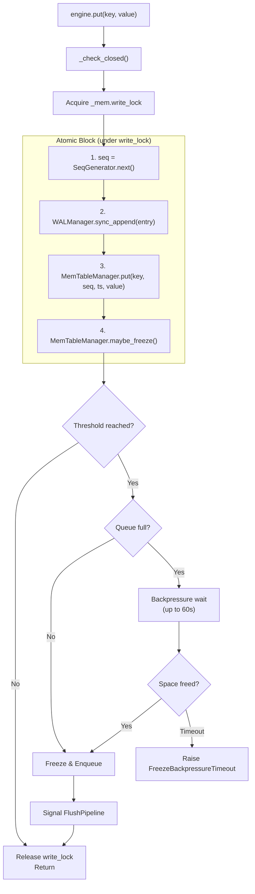
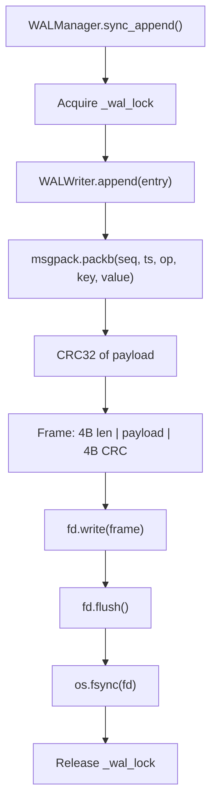
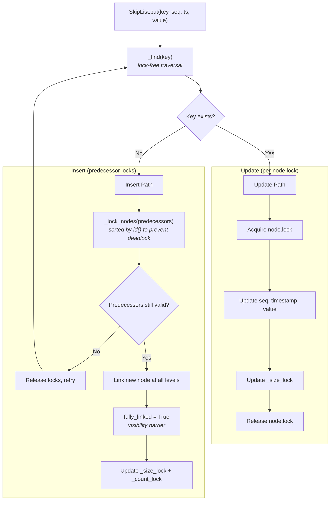
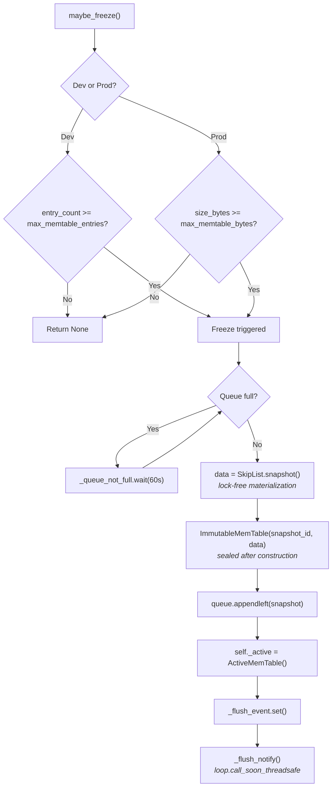
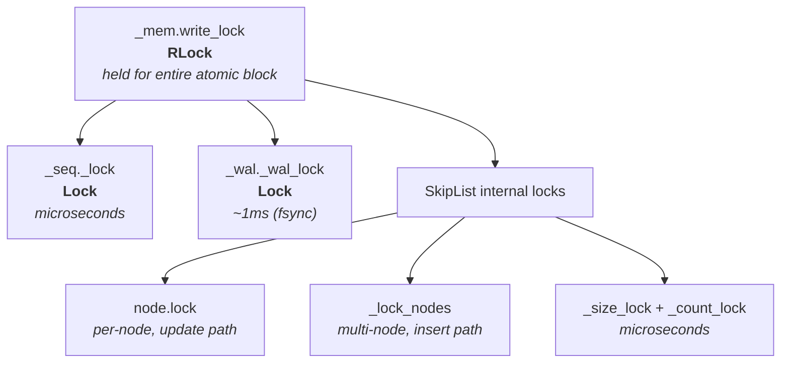
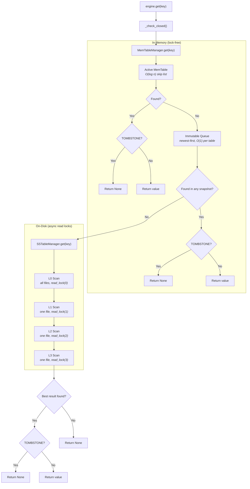
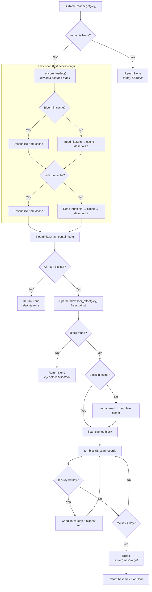
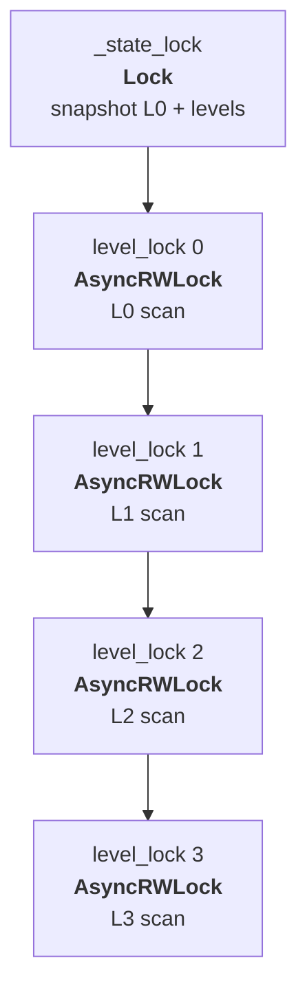
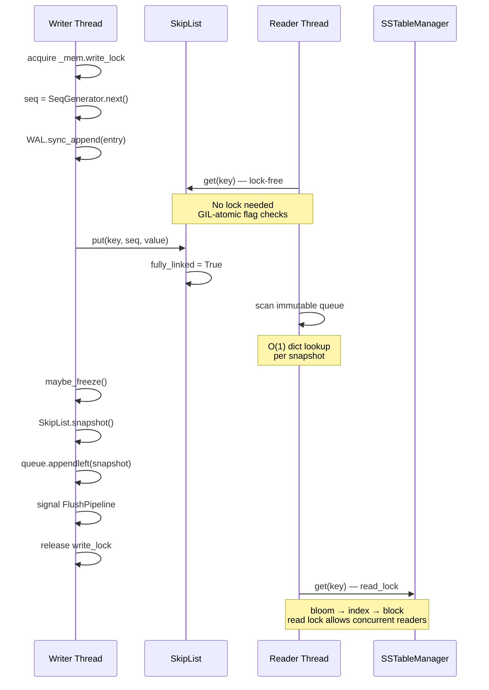

# Read & Write Flow

This document traces the exact path of data through the lsm-kv engine for both write and read operations. Every lock acquisition, every conditional branch, and every data transformation is documented.

---

## Write Flow

### Overview

All writes (put, delete) follow the same atomic path under a single lock. The key invariant is **durability before visibility** — the WAL is fsynced before the memtable is updated.

### Step 1: Sequence Generation

`SeqGenerator.next()` atomically increments and returns a monotonically increasing integer under its own `threading.Lock`. This seq number is the MVCC version — higher seq means newer data.

### Step 2: WAL Durability

**Lock ordering constraint**: `_mem.write_lock` is always acquired before `_wal_lock`. Reversing this order would cause deadlock, since the write path holds `write_lock` while calling `sync_append()` which acquires `_wal_lock` internally.

### Step 3: MemTable Insert

The write delegates through `MemTableManager` → `ActiveMemTable` → `SkipList`:

### Step 4: Conditional Freeze

`maybe_freeze()` checks whether the active memtable has crossed its threshold:

| Mode | Condition | Default |
|------|-----------|---------|
| Dev | `entry_count >= max_memtable_entries` | 10 entries |
| Prod | `size_bytes >= max_memtable_bytes` | 64 MB |

### Delete vs Put

`delete(key)` follows the identical path but writes `OpType.DELETE` and `value=TOMBSTONE` (sentinel `b"\x00__tomb__\x00"`). The tombstone propagates through flush and compaction. Readers check for tombstones and return `None`.

### Manual Flush

`engine.flush()` calls `force_freeze()`, which bypasses the threshold check and freezes unconditionally (unless the memtable is empty). The same backpressure and signaling logic applies.

### Write Path Lock Hierarchy

### Write Path Error Conditions

| Error | Condition | Recovery |
|-------|-----------|----------|
| `EngineClosed` | Engine has been closed | Caller must reopen |
| `OSError` | WAL fsync failure | Write fails atomically (memtable not updated) |
| `SkipListKeyError` | Empty key | Caller error |
| `SkipListInsertError` | 64 concurrent retries exhausted | Extremely rare contention |
| `SnapshotEmptyError` | Freeze called on empty table | Should never happen (threshold > 0) |
| `FreezeBackpressureTimeout` | Queue full for 60 seconds | Flush pipeline may be stuck |

---

## Read Flow

### Overview

Reads scan from newest to oldest data sources. The first match with the highest sequence number wins. No write locks are acquired — reads are non-blocking.

### Step 1: Active MemTable Lookup

`SkipList.get(key)` performs a lock-free top-down traversal starting from the highest occupied level. At level 0, it checks whether the successor node matches the key and is visible (`fully_linked=True`, `marked=False`). These boolean reads are atomic under CPython's GIL.

Returns `(seq, value)` or `None`. Does not return `timestamp_ms` — only `seq` is needed for MVCC ordering.

### Step 2: Immutable Queue Scan

The queue is scanned **newest-first** (deque index 0 is newest). Each `ImmutableMemTable.get(key)` is an O(1) dict lookup — the internal `_index` dict maps keys directly to their position in the sorted data list.

**Concurrent safety**: A `list()` copy of the deque is taken before iteration to prevent concurrent modification if `pop_oldest()` runs during the scan. The copy is O(n) but n <= 4 (queue max).

### Step 3: L0 SSTable Scan

All L0 files must be checked because their key ranges overlap. The scan holds a read lock on level 0 (via `AsyncRWLock`) to prevent compaction from swapping files mid-scan.

For each file, `SSTableReader.get(key)` executes this pipeline:

#### Bloom Filter Check

`BloomFilter.may_contain(key)` hashes the key with multiple mmh3 seeds and checks the bit array. If **any** bit is unset, the key is definitely absent — skip this SSTable. False negatives are impossible; false positives are controlled by `bloom_fpr` config (5% dev, 1% prod).

#### Sparse Index Bisect

`SparseIndex.floor_offset(key)` uses `bisect_right` to find the block whose first key is <= the search key. Returns the byte offset into `data.bin` where the candidate block starts, or `None` if the key is before the first block.

#### Block Cache + mmap Scan

The identified block is checked in the block cache first. On a cache miss, the block is read via mmap (zero-copy memoryview) and populated into the cache. Records within the block are scanned sequentially via `iter_block()`. Since records are sorted by key, the scan stops early when `rec.key > key`.

#### MVCC: Highest Seq Wins

Across all L0 files, the result with the highest `seq` is kept. This ensures the most recent write wins even when the same key appears in multiple L0 SSTables.

### Step 4: L1+ SSTable Scan

Each level above L0 has at most one SSTable. The scan proceeds sequentially from L1 upward, with a read lock per level. The same `SSTableReader.get()` flow (bloom → index → block) applies.

### Step 5: Tombstone Resolution

After finding a result from any source, the engine checks if the value is the `TOMBSTONE` sentinel. If so, the key has been deleted — return `None`.

### Read Path Lock Summary

No write locks are ever acquired during reads. The memtable scan is entirely lock-free. The `AsyncRWLock` read locks allow multiple concurrent readers while blocking compaction commits.

### Read Path Data Types

| Source | Returns | Type |
|--------|---------|------|
| SkipList.get() | `(seq, value)` | `tuple[int, bytes] \| None` |
| ImmutableMemTable.get() | `(seq, value)` | `tuple[int, bytes] \| None` |
| SSTableReader.get() | `(seq, timestamp_ms, value)` | `tuple[int, int, bytes] \| None` |
| LSMEngine.get() | `value` | `bytes \| None` |

---

## Interaction Between Read and Write

Reads and writes can happen concurrently without blocking each other:

**Key concurrency properties:**

- **Writers hold `_mem.write_lock`** — serializes writes but does not block readers
- **Readers are lock-free in memtable** — skip list traversal checks GIL-atomic flags
- **Readers hold AsyncRWLock read locks** — multiple readers proceed simultaneously
- **Compaction holds write locks** — blocks new readers only during the brief commit phase (< 5ms)
- **Flush pipeline is async** — runs on the event loop, does not hold write locks
